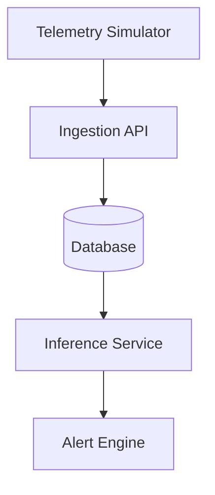
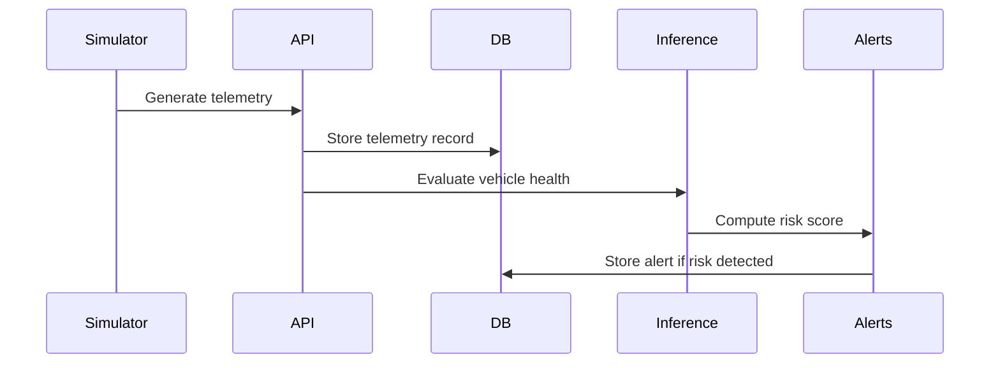
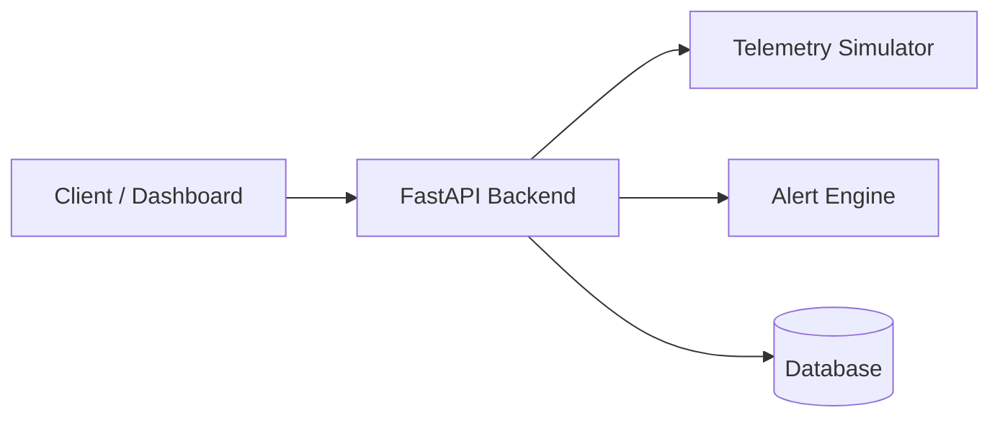

# 🚗 Vehicle Telemetry Platform


A production-style backend system that simulates fleet telemetry, analyzes vehicle health, predicts failure risk, and generates intelligent alerts.

This project demonstrates **telemetry ingestion, predictive analytics, alerting systems, and observability patterns** used in modern fleet platforms.

---

# 📌 Project Overview

The platform simulates vehicle telemetry data and processes it through a pipeline consisting of:

1. Telemetry generation
2. API ingestion
3. Data persistence
4. Health evaluation
5. Risk inference
6. Alert generation

This mirrors real-world fleet management and predictive maintenance systems.

---

# 🏗 System Architecture



---

# 🔄 Data Flow

-----

# 🚀 Deployment Architecture

----

# 🧩 Component Responsibilities

## Telemetry Simulator
Location
```
services/telemetry_simulator.py
```
Responsibilities:
- Generate realistic vehicle telemetry
- Simulate RPM and speed correlation
- Simulate engine temperature behavior
- Inject probabilistic failures

## Ingestion API
Location
```
app/main.py
```
Responsibilities:
- Accept telemetry data
- Persist telemetry records
- Trigger health evaluation
- Trigger alert processing
- Provide analytics endpoints

## Database Layer
Stores two main entities.

 Telemetry Records
```
vehicle_id
speed
rpm
engine_temp
battery_voltage
timestamp
```
 Alerts
 ```
vehicle_id
severity
message
timestamp
```

## Inference Service
Responsible for evaluating vehicle health.

Modules:
```
app/health_service.py
services/alert_service/risk_evaluator.py
```
Responsibilities:
- Analyze telemetry signals
- Detect anomalies
- Generate risk score inputs

## Alert Engine

Location
```
services/alert_service/
```
Modules:
```
alert_engine.py
risk_evaluator.py
severity.py
```
Responsibilities:
- Compute risk score
- Categorize severity
- Generate alerts

Severity Levels:
```
Low
Medium
Critical
```

